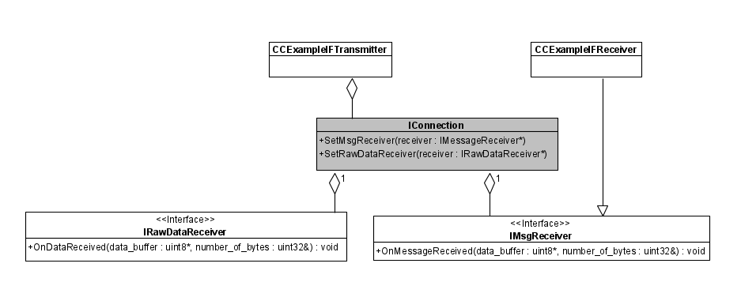
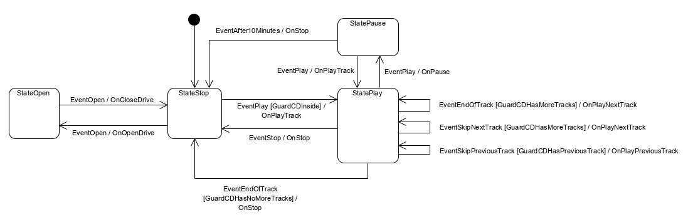
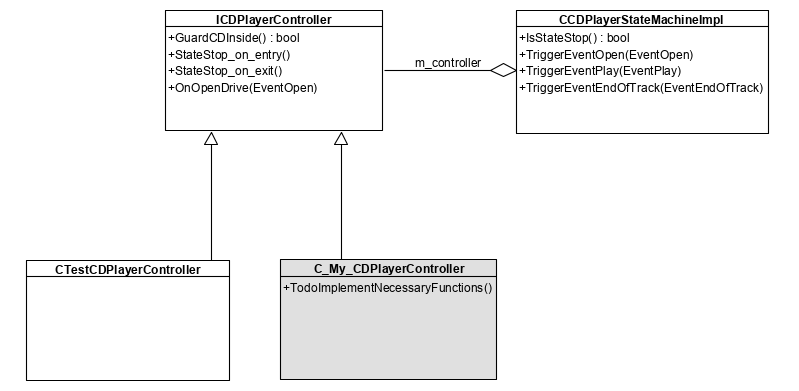

# Description

Kojen is a C++ protocol, C++ state-machine and C++/C# Class Diagram (from UML Code Model) code-generation tool written in Python and existing within the Python Package Index (PyPi). 

The default generated state-machine uses the fast and lightweight single-header-file-only [boost sml](https://boost-ext.github.io/sml/). It is linked to the repository as a git sub-module for an out-the-box solution. This is suitable for both embedded and PC applications using C++14 and higher.

For state-machines and software-architecture-from-UML-model : user-code is preserved within special comment tags. The main concept is that code-generation is a manually-initiated process and exists within a hand-crafted source-repository. The intention is to be able to manually program in all auto-generated state-machine / Class Diagram output source files, and preserve hand-crafted code within those files when system requirements change. Its not intended to disassociate the programmer from the code (like most CASE tools). Typically after the Design phase code-generation is done first in the initial implementation phase (and maybe a few more times until things are as they should be) and then development is done the usual way. Naturally in time further changes/additions can be done in the model (Updating the 'diagrams' first) and their changes propagated to code by generation : this also allows for updates to the design (from Model -> Code) in a non-intrusive manner. Protocols and their unit tests are the only files which require no hand-coding.

Unit testing : Tests for protocols are generated, and tests for state-machines too (but those require some hand-coding, code preservation applies). The included testing framework is extremely light-weight and great for embedded (and PC) application : [minunit](https://github.com/kohjaen/minunit) is used for this and it is also linked to the repository as a git sub-module. The original fork of minunit is a C-based single header file, but some improvements have been made (not possible with C) so it now consists of a single header and a single cpp file.

It currently supports Windows/Linux/MacOS and FreeRTOS and includes multi-threading components (threads/queues/dispatchers/fixed-block-memory-allocators as well as stl-with-fixed-block-mem-allocator wrappers for no spurious heap usage and much faster STL containers) that works on all platforms by including CMake configuration files in generated outputs.

Message Queues are platform independant and adding a new RTOS will only mean adding a 'condition variable' like synchronization mechanism for that RTOS (the provided example of how it is done with FreeRTOS can be followed).
# Quickstart
## Example folder

The git repository has a fully functional example (which is used in the CI), including CMake integration. An executable is generated and that runs all unit tests. Feel free to go straight there. The example is described below.

## Protocol
### Input
In a folder where you will execute your project from, create the interface definition file `MyInterface.py`.

In your interface definition file `MyInterface.py` create a function `CreateInterface()` that returns a  `kojen.Interface` object. 

Here is an example of what is permissible in an interface. For messages, make sure each has a unique message-id (second parameter after the name in the constructor)
```python
from kojen.interface_base import *

def CreateInterface():
    sCustomStruct = Struct('sCustomStruct')
    sCustomStruct.AddType('m_Member1','uint16')
    sCustomStruct.AddType('m_Member2','uint16')
    sCustomStruct.AddType('m_Member3','uint32')

    MsgSomeCMD = Message('MsgSomeCMD',0x01)
    MsgSomeCMD.AddType('m_Member1','uint8')

    MsgSomeCMDRSP = Message('MsgSomeCMDRSP',0x02)
    MsgSomeCMDRSP.AddStruct('mStructMember1',sCustomStruct)
    MsgSomeCMDRSP.AddType('m_Member2','uint8')
    
    MsgSomeREQ = Message('MsgSomeREQ',0x03)
    MsgSomeREQ.AddType('m_Member1','uint8')

    #Array of type : Not supported by ARM due to dynamic memory allocation requirements
    MsgSomeREQRSP = Message('MsgSomeREQRSP',0x04)
    MsgSomeREQRSP.AddStruct('mStructMember1',sCustomStruct)
    MsgSomeREQRSP.AddType('m_Member2','uint8')
    MsgSomeREQRSP.AddArrayOfType('mArrayMember3','double')


    MsgSomeUnsolicitedData = Message('MsgSomeUnsolicitedData',0x05)
    MsgSomeUnsolicitedData.AddArrayOfStruct('mStructArrayMember1',sCustomStruct)

    #
    # Includes : Enums and defines ...
    #
    Type = Enum("Type")
    Type.Add("kOne", 0)
    Type.Add("kTwo", 1)

    Revision = Enum("Revision")
    Revision.Add("kVersion1", 0)
    Revision.Add("kVersion2", 1)
    Revision.Add("kVersion3", 2)

    interface = Interface('IMyInterfaceIO')

    interface.AddEnum(Type)
    interface.AddEnum(Revision)

    interface.AddHashDefine("THREE", 3)
    interface.AddHashDefine("PI", 3.14159265359)

    interface.AddStruct(sCustomStruct)
    interface.AddMessage(MsgSomeCMD)
    interface.AddMessage(MsgSomeCMDRSP)
    interface.AddMessage(MsgSomeREQ)
    interface.AddMessage(MsgSomeREQRSP)
    interface.AddMessage(MsgSomeUnsolicitedData)

    return interface
```

Then, create a file `Generate.py`.


```python
import kojen.Generate as Generate
import os

username = "myname@mydomain.com"
namespacename = "ExampleIO"
classname = "CExampleIF"
declspec = "" # your define for symbol export/import in C++ e.g. MY_PROJECT_API
outputdir = os.path.join(os.path.abspath(os.path.dirname(__file__)), os.path.join("autogen","protocol"))
protocolfile = os.path.join(os.path.abspath(os.path.dirname(__file__)), "MyInterface.py")
Generate.Protocol(outputdir, protocolfile, namespacename, classname, declspec)
```

Execute `Generate.py` using python. Your C++ code should be in the folder **./autogen/protocol**.

> **Please note** : you may include this code in a library, and thus want to export some of the generated features.
> Typically somewhere in a common header of your C++ code, you would have declared something like

```cplusplus
#ifdef MY_PROJECT_EXPORTS
#	define MY_PROJECT_API __declspec(dllexport)
#else
#	define MY_PROJECT_API __declspec(dllimport)
#endif
```

> You should thus pass **MY_PROJECT_API** as the *declspec* argument to the generator.

### Output

There will be several files in the output folder.

* allplatforms *(folder containing required framework files)*
* CExampleIF.h *(contains all factories to create messages which automatically and correctly fill in the headers, as well as serialization to/from bytestreams.)
* CExampleIF.cpp
* CExampleIFDefines.h *(contains all enums and defines)
* CExampleIFReceiver.h *(contains a derivable class that received fully constructed messages. Override receive functions to handle them as per need.)
* CExampleIFReceiver.cpp
* CExampleIFStructs.h *(contains all structs)
* CExampleIFTests.cpp *(contains all unit tests)
* CExampleIFTransmitter.h *(contains all functions to transmit fully constructed messages. Highly advices to use the autogenerated factories.)
* CExampleIFTransmitter.cpp
* MsgHeader.h

The following class diagram explains roughly where focus should be when implementing for actual integration into the real system.



*IConnection* is the interface to derive from for your actual physical layer for an embedded platform. If you use boost on x86/x64, in the 'allplatforms' directory exist classes for substituting this with a TCPConnection, UDPConnection and SerialPort.
Have a good look at the unit tests, this shows roughly how to derive from it and connect everything up, albeit creating a loopback connection, and implementing uncessary routing as the interface for the tests have a special requirement.

A summary to link it up:
* Create a derived IConnection that knows how to send and receive physical layer data.
* Create a generated Transmitter, passing it a pointer to this connection.
* Create a generated Receiver
* Set the Receiver to the derived IConnection. You will then get messages in the message receiving functions...override the correct ones to handle them.
* Use the Transmitter to send.

## State Machine
### Requrements
- Don't forget to update your git submodules when checking out.
### Input
The following diagram defines (roughly) a state machine for a CD player.



This state machine can be represented by the following transition table in python (format : 'startstate', 'event', 'nextstate', 'action', 'guard'):

```python
#
# StartState    Event                     NextState     Action                 Guard
#
 'StateStop',  'EventOpen',              'StateOpen',  'OnOpenDrive',         'None'
 'StateStop',  'EventPlay',              'StatePlay',  'OnPlayTrack',         'GuardCDInside'
 'StateOpen',  'EventOpen',              'StateStop',  'OnCloseDrive',        'None'
 'StatePlay',  'EventPlay',              'StatePause', 'OnPause',             'None'
 'StatePlay',  'EventEndOfTrack',        'None',       'OnPlayNextTrack',     'GuardCDHasMoreTracks'
 'StatePlay',  'EventEndOfTrack',        'StateStop',  'OnStop',              'GuardCDHasNoMoreTracks'
 'StatePlay',  'EventSkipNextTrack',     'None',       'OnPlayNextTrack',     'GuardCDHasMoreTracks'
 'StatePlay',  'EventSkipPreviousTrack', 'None',       'OnPlayPreviousTrack', 'GuardCDHasPreviousTrack'
 'StatePlay',  'EventStop',              'StateStop',  'OnStop',              'None'
 'StatePause', 'EventPlay',              'StatePlay',  'OnPlayTrack',         'None'
 'StatePause', 'EventAfter10Minutes',    'StateStop',  'OnStop',              'None'
```

Create a file `Generate.py` (or add your state machine to the one already present in your project) :

```python
from kojen import Generate

#
# Generate Statemachine (from TransitionTable)
#
transition_table = []
#                         StartState    Event                     NextState     Action                 Guard
transition_table.append(['StateStop',  'EventOpen',              'StateOpen',  'OnOpenDrive',         'None'                   ])
transition_table.append(['StateStop',  'EventPlay',              'StatePlay',  'OnPlayTrack',         'GuardCDInside'          ]) 
transition_table.append(['StateOpen',  'EventOpen',              'StateStop',  'OnCloseDrive',        'None'                   ]) 
transition_table.append(['StatePlay',  'EventPlay',              'StatePause', 'OnPause',             'None'                   ])
transition_table.append(['StatePlay',  'EventEndOfTrack',        'None',       'OnPlayNextTrack',     'GuardCDHasMoreTracks'   ])
transition_table.append(['StatePlay',  'EventEndOfTrack',        'StateStop',  'OnStop',              'GuardCDHasNoMoreTracks' ])
transition_table.append(['StatePlay',  'EventSkipNextTrack',     'None',       'OnPlayNextTrack',     'GuardCDHasMoreTracks'   ]) 
transition_table.append(['StatePlay',  'EventSkipPreviousTrack', 'None',       'OnPlayPreviousTrack', 'GuardCDHasPreviousTrack'])
transition_table.append(['StatePlay',  'EventStop',              'StateStop',  'OnStop',              'None'                   ])
transition_table.append(['StatePause', 'EventPlay',              'StatePlay',  'OnPlayTrack',         'None'                   ])
transition_table.append(['StatePause', 'EventAfter10Minutes',    'StateStop',  'OnStop',              'None'                   ])
username = "myname@mydomain.com"

eventsinterface = None
namespacename = "CDPlayerSM"
classname = "CDPlayer"
declspec = ""
outputdir = "autogen/state_machine"
templatedir = "" # defaults are for 'SML'
Generate.StateMachine(transition_table, eventsinterface, outputdir, namespacename, classname, declspec, username, templatedir)
```

Execute `Generate.py` using python. Your C++ code should be generated to the configured folder **./autogen/state_machine**.

> **Please note** : you may may wish to parameterize events in your statemachine. An event is of type `kojen.Struct` in a `kojen.Interface` object. 
> Simply follow the quickstart for protocols, creating and returning an interface : your Event structs need to have the exact same name as defined in the transition table.
> You should thus pass your interface object  as the *eventsinterface* argument to the generator instead of **None**. 

### Output

There will be several files in the output folder.

* allplatforms *(folder containing required framework files)*
* CDPlayerStateMachine.h
* CDPlayerStateMachineImpl_SML.cpp *(all state machine code generated for boost-sml)*  
* ICDPlayerController.h
* Test.CDPlayerStateMachine.cpp
  
The following class diagram explains roughly where focus should be when implementing for test-driven development as well as for actual integration into the real system.



White classes are auto-generated, and have code-preservation features. Grey is what you have to manually create, and implement for integration into your real system.

All required functionality for your system should be implemented in the **Controller** classes, being the base-class *ICDPlayerController*, the derived *C_My_CDPlayerController* and the derived test class *CTestCDPlayerController*.

It is critical that as much of the 'business logic' is put into the base class *IPlayerController*, and tested using the *CTestCDPlayerController* in the unit-tests as possible, such that the actual integrated *C_My_CDPlayerController* uses unit-tested business logic, with a good example of how its intended to work in the unit tests...as well as for regression testing and continuous integration.

As the state-machine-implementation uses the controller base class, the following construction is valid for unit tests and system integration by substituting the correct controller:

```cplusplus
  CTestCDPlayerController controller;
  auto sm = ICDPlayerStateMachine::Create(&controller);
```

All state queries and event triggering are done using the ```sm``` instance.

<!---
### Deferred Events

Deferred events are supported in SML and MSM state machines.

In the example CD player statemachine this use-case could be pressing 'play' whilst the tray is closing : the close button will be pressed, and the tray will start closing, however the software trigger for *EventOpen* will only occur on the interrupt signalling that the tray actuator has completed either opening/closing the tray. 
This can take up to several seconds. In that time, the 'play' button could be pressed. 

The desired behaviour would be that once the tray is closed, the CD starts playing.

This can be achieved by manually adding the correct deferred event in the *CDPlayerStateMachineImpl_SML.cpp* in the code preservation tags at the end of the transition table:

```cplusplus
/// {{{USER_DEFERRED_EVENTS}}}
, StateOpen + event<EventPlay> / defer
/// {{{USER_DEFERRED_EVENTS}}}
```

For *boost::msm* this can be achieved by manually adding the correct deferred event in code preservation tags in the state struct for *StateOpen* in *CDPlayerStateMachineImpl_SML.cpp* :

```cplusplus
/// {{{USER_StateOpen_DEFERRED_EVENTS}}}
typedef boost::mpl::vector<EventPlay> deferred_events;
/// {{{USER_StateOpen_DEFERRED_EVENTS}}} 
```

I believe this will also allow the sequence of 'play' then 'close' to work.
--->
